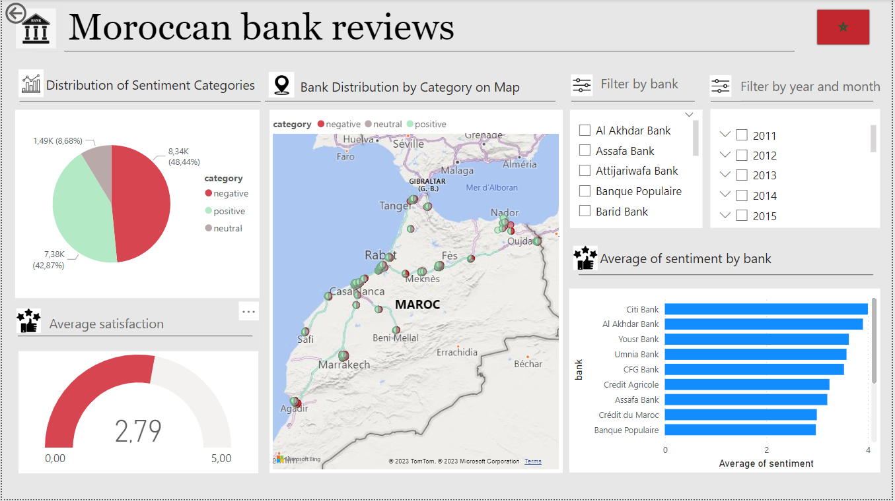

# Moroccan Bank Reviews

## Introduction
This project aims to collect and analyze customer reviews for Moroccan banks. The goal is to build a data mining and data warehousing platform that facilitates the collection, cleaning, and analysis of customer feedback data. The platform will enable banks in Morocco to gain valuable insights from customer reviews, identify areas for improvement, and make data-driven decisions to enhance customer satisfaction

## Features
- 
<b>Sentiment Analysis </b>: Utilizes advanced sentiment analysis techniques to extract sentiment scores from customer reviews.
- 
<b>Star Schema </b>: Employs a star schema structure to optimize data storage and facilitate efficient querying.
- 
<b>PostgreSQL Database </b>: Establishes a PostgreSQL database to store cleaned and processed data.
- 
<b>Power BI Integration </b>: Connects the PostgreSQL database to Power BI for dynamic data visualization and exploration.

## Sentiment Analysis
- 
<b>BERT Model </b>: Utilizes a pre-trained BERT model for sentiment analysis, enabling accurate sentiment scoring of customer reviews.
- 
<b>Sentiment Categories </b>: Categorizes sentiment scores into positive, negative, and neutral categories for enhanced interpretation.
- 
<b>Insights </b>: Provides insights into overall sentiment distribution, sentiment trends over time, and bank-specific sentiment variations.

## Dashboard

